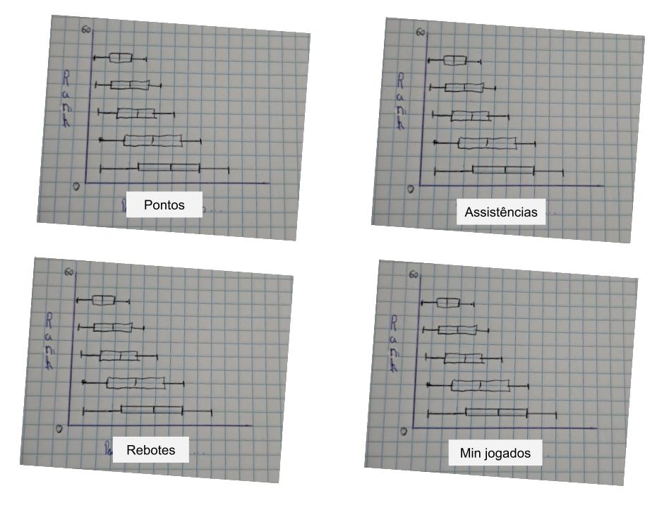

```{r setup, include=FALSE}
knitr::opts_chunk$set(message = FALSE,
                      warning = FALSE,
                      fig_width = 8,
                      fig.height = 4,
                      fig.align = 'center')
```

``` {r library, echo = FALSE}
library(ggplot2)
library(plotly)
library(dplyr)
library(ggrepel)
library(gridExtra)
library(grid)
library(knitr)
library(kableExtra)
library(DT)
```

# Formulação e documentação da ideia

A escolha da base se deu a partir de uma exploração no [**Kaggle**](https://www.kaggle.com/), na qual nos deparamos com a base de dados sobre os [jogadores draftado na NBA](https://www.kaggle.com/datasets/mattop/nba-draft-basketball-player-data-19892021). Definimos então, que essa seria a base utilizada. Analisando a base, vimos que, além de apresentar os jogadores, a posição no qual foram draftados e os times, desde 1989, também haviam as estatísticas de cada jogador ao longo de sua carreira. Conforme pode ser visualizado abaixo.

```{r}
base_de_dados <- read.csv("nbaplayersdraft.csv", sep = ",")

kable(head(base_de_dados), "html") %>% kable_styling("striped") %>% scroll_box(width = "100%")
```

Antes de partimos para a hipótese, cabe uma explicação sobre o processo de Draft da NBA.

## O que é o Draft da NBA?

O Draft da NBA é o processo em que jogadores amadores são escolhidos por franquias e entram oficialmente na maior liga de basquetebol profissinal do mundo, a NBA. O evento é composto por duas rodadas de 30 escolhas cada, com uma ordem pré-definida. Os times se revezam e cada um seleciona um jogador por rodada. Ou seja, 60 atletas são recrutados. Portanto, há de se imaginar que os primeiros escolhidos do Draft são melhores jogadores e farão melhores performances em sua carreira na liga.

Com isso, surgiu o seguinte questionamento, que veio a se tornar a hipótese a ser respondida com esse trabalho.

## Hipótese

<center> **A posição em que o jogador foi draftado realmente tem correlação com o seu desempenho durante a carreira?**</center>

Dessa forma, pretendemos validar ou invalidar a hipótese acima, a partir da visualização dos dados da base escolhida.

Para tal, inicialmente, pensamos em criar quatro gráficos categórico vs quantitativo, onde caso exista alguma correlação os jogadores escolhidos nas primeiras posições, devem ter estatísticas melhores do que aqueles escolhidos nas últimas. Sendo assim, para validar a hipótese, usando como métrica as estatísticas **pontos**, **rebotes**, **assistências** e **minutos jogados**, esperamos que os gráficos se apresentem conforme o rascunho abaixo.

``` {r, echo = FALSE}

```

# Análise Exploratória da base de dados 

Como temos a hipótese a ser respondida em mente, trataremos a princípio apenas as variáveis pertinentes, sendo que, caso venha a se tornar necessário a inclusão de outras variáveis, iremos analisá-las posteriormente.   

Antes de qualquer análise mais aprofundada, devemos entender nossa base de dados. Batendo o olho no arquivo **.cvs**, podemos ver que cada linha representa um jogador e cada coluna uma variável a respeito dele. Assim, podemos começar a tratar as variáveis.
Para responder à hipótese, precisamos, acima de tudo, conseguir identificar a posição em que o jogador foi escolhido no draft. Para isso, temos as variáveis **rank** e **overall_pick**, que são o mesmo, e tratam exatamente da posição em que o jogador foi draftado. Essas, são variáveis qualitativas ordinais que vão de 1 a 60.   

Tendo a posição definida, precisamos olhar agora para as variáveis que nos ajudarão a definir o desempenho do jogador. Previamente, definimos que as estatísticas **pontos**, **rebotes**, **assistências** e **minutos jogados** seriam as responsáveis por determinar o desempenho. Essa escolha vai conforme a comunidade de basquete, que frequentemente usa essas estatísticas para definir a grandeza de um jogador, principalmente os **pontos**. Contudo, entendendo a diversidade de posições no basquete, não é justo analisar apenas pelos pontos, e sim pelo conjunto da obra, ou seja, **pontos**, **rebotes** e **assistências**. Junto a isso, os **minutos jogados** são de extrema importância, já que um jogador importante para o time, jogará mais minutos em cada partida.   

Analisando o banco de dados, vemos que a coluna **minutes_played** traz os minutos jogados, a coluna **points** traz os pontos totais, a coluna **total_rebounds** traz os rebotes e a coluna **assists** traz as assistências. Todas essas, são variáveis quantitativas discretas.   

Com as variáveis devidamente, definidas, podemos começar a análise exploratória. Inicialmente, iremos aplicar a função **summary** em todas as variáveis, para observar seu comportamento.

```{r}
base_de_dados_resumida <- select(base_de_dados, points, minutes_played, total_rebounds, assists)

summary(base_de_dados_resumida)
```

Já pudemos identificar a ocorrência de valores nulos na base. Analisando-a mais profundamente, podemos determinar que os valores nulos correspondem a jogadores que foram draftados, mas que nunca jogaram na NBA. Por isso, resolvemos desconsiderar esses valores, sem perda de dados significantes.

```{r}
base_de_dados_resumida <- na.omit(select(base_de_dados, points, minutes_played, total_rebounds, assists))

summary(base_de_dados_resumida)
```

Agora, podemos a analisar unidimensional das variáveis que serão utilizadas. 

```{r, echo = FALSE}
theme_set(theme_classic())
theme_update(legend.position="top")
theme_update(plot.title = element_text(size = 12, face = "bold"))
```

```{r}
p_points <- ggplot(data = base_de_dados_resumida, mapping = aes(x = points)) +
  geom_histogram() +
  labs(x = "Pontos", y = "Contagem")

p_minutes <- ggplot(data = base_de_dados_resumida, mapping = aes(x = minutes_played)) +
  geom_histogram() +
  labs(x = "Minutos Jogados", y = "Contagem")

p_assists <- ggplot(data = base_de_dados_resumida, mapping = aes(x = assists)) +
  geom_histogram() +
  labs(x = "Assistências", y = "Contagem")

p_rebounds <- ggplot(data = base_de_dados_resumida, mapping = aes(x = total_rebounds)) +
  geom_histogram() +
  labs(x = "Pontos", y = "Contagem")

grid.arrange(p_points, p_minutes,
             p_assists, p_rebounds,
             ncol=2, nrow=2)
```

Com essa análise, já podemos observar algo interessante. Podemos ver que há uma maior ocorrência de todas as variáveis nos valores mais baixos. Analisando a base de dados de forma visual, identificamos como uma possível causa disso, que jogadores que foram draftados em anos mais recentes, como  2020, têm pouco tempo de carreira e, consequentemente, têm menores estatísticas. Para confirmar isso, resolvemos replicar a analise, para a variavel pontos, separando por pelo ano em que o jogador foi draftado.

```{r}
dados_year_points <- na.omit(select(base_de_dados, points, year))

dados_2021 <- dados_year_points %>% filter(year == 2021)
dados_2020 <- dados_year_points %>% filter(year == 2020)
dados_1990 <- dados_year_points %>% filter(year == 1990)
dados_2000 <- dados_year_points %>% filter(year == 2000)

p_2021 <- ggplot(data = dados_2021, mapping = aes(x = points)) +
  geom_histogram() +
  labs(x = "Pontos", y = "Contagem", title = "2021")

p_2020 <- ggplot(data = dados_2020, mapping = aes(x = points)) +
  geom_histogram(breaks = seq(0, 20000, 10)) +
  labs(x = "Pontos", y = "Contagem", title = "2020")

p_1990 <- ggplot(data = dados_1990, mapping = aes(x = points)) +
  geom_histogram() +
  labs(x = "Pontos", y = "Contagem", title = "1990")

p_2000 <- ggplot(data = dados_2000, mapping = aes(x = points)) +
  geom_histogram() +
  labs(x = "Pontos", y = "Contagem", title = "2000")

grid.arrange(p_2021, p_2021,
             p_1990, p_2000,
             ncol=2, nrow=2)
```

Aqui, vale destacar que a escala dos eixos estão extremamente diferentes, para melhor visualização e pela dificuldade em programar outra maneira onde as escalas estejam iguais e seja visível. Contudo, para o nosso propósito, esses gráficos irão servir.
Como podemos observar, nossa suspeita inicial se confirmou, pois nos anos mais recentes (2021 e 2020), a maioria dos dados se concentram abaixo dos **1000** pontos, enquanto os dados de mais antigos (1990 e 2020) se concentram até a região dos **5000** pontos. Isso já é um empecilho para o uso desses dados, pois dessa forma, não poderemos analisar bem a performance dos jogadores, já que jogadores mais antigos serão favorecidos. 
Para contornar esse problema, precisamos ponderar essas estatísticas pelo tempo jogado. Por sorte, temos na base de dados, todas estatísticas ponderadas por partidas. Então mudaremos o foco, e começaremos a analisar essas estatísticas, recomeçando a análise. Para tal, serão usadas as variáveis ponderadas **points_per_game**, **average_assists**, **average_total_rebounds** e **average_minutes_played**.

```{r}
base_de_dados_resumida <- na.omit(select(base_de_dados, points_per_game, average_assists, average_total_rebounds, average_minutes_played))

summary(base_de_dados_resumida)
```
Então são plotados os gráficos.

```{r}
p_points <- ggplot(data = base_de_dados_resumida, mapping = aes(x = points_per_game)) +
  geom_histogram() +
  labs(x = "Pontos", y = "Contagem")

p_minutes <- ggplot(data = base_de_dados_resumida, mapping = aes(x = average_minutes_played)) +
  geom_histogram() +
  labs(x = "Minutos Jogados", y = "Contagem")

p_assists <- ggplot(data = base_de_dados_resumida, mapping = aes(x = average_assists)) +
  geom_histogram() +
  labs(x = "Assistências", y = "Contagem")

p_rebounds <- ggplot(data = base_de_dados_resumida, mapping = aes(x = average_total_rebounds)) +
  geom_histogram() +
  labs(x = "Pontos", y = "Contagem")

grid.arrange(p_points, p_minutes,
             p_assists, p_rebounds,
             ncol=2, nrow=2)
```

Agora, podemos notar uma melhor distribuição dos dados. Contudo, para confirmar isso, repetiremos a analise dos anos mais recentes e de anos mais antigos, para comparação e confirmação.

```{r}
dados_year_points <- na.omit(select(base_de_dados, points_per_game, year))

dados_2021 <- dados_year_points %>% filter(year == 2021)
dados_2020 <- dados_year_points %>% filter(year == 2020)
dados_1990 <- dados_year_points %>% filter(year == 1990)
dados_2000 <- dados_year_points %>% filter(year == 2000)

p_2021 <- ggplot(data = dados_2021, mapping = aes(x = points_per_game)) +
  geom_histogram() +
  labs(x = "Pontos por Jogo", y = "Contagem", title = "2021")

p_2020 <- ggplot(data = dados_2020, mapping = aes(x = points_per_game)) +
  geom_histogram(breaks = seq(0, 20000, 10)) +
  labs(x = "Pontos por Jogo", y = "Contagem", title = "2020")

p_1990 <- ggplot(data = dados_1990, mapping = aes(x = points_per_game)) +
  geom_histogram() +
  labs(x = "Pontos por Jogo", y = "Contagem", title = "1990")

p_2000 <- ggplot(data = dados_2000, mapping = aes(x = points_per_game)) +
  geom_histogram() +
  labs(x = "Pontos por Jogo", y = "Contagem", title = "2000")

grid.arrange(p_2021, p_2021,
             p_1990, p_2000,
             ncol=2, nrow=2)
```

Novamente se confirma a distribuição mais igualitária dos dados, indicando que essas variáveis são mais eficazes para determinação do desempenho dos jogadores.